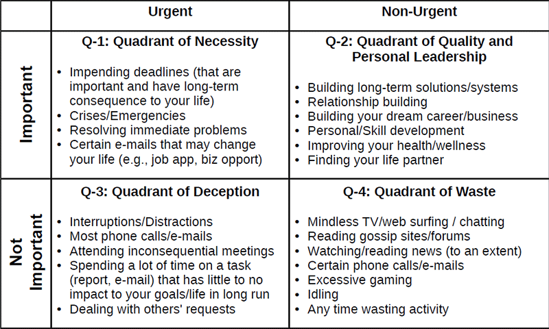
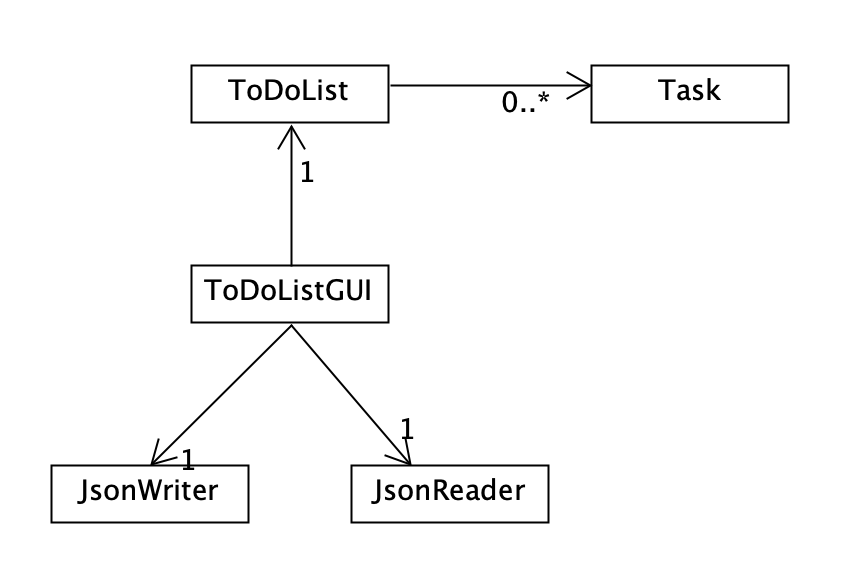

# Opus

## About
Opus is a command-line and GUI To-Do List application that helps you prioritize tasks by categorizing them based on **urgency and importance**.
This time management method was proposed in *The 7 Habits of Highly Effective People* by Stephen Covey:

Stephen Covey proposes that the best way to prioritize tasks is by the order of the quadrant: Q1, Q2, Q3, and lastly Q4. The To-Do List is ordered in the same way. There is also a **"what's next"** option that displays your next task by this priority You can also add **tags** to your tasks, such as University, Work, Grocery, etc. There is an option to display your tasks categorized by tag You can add **due dates** to tasks. You can then see today's tasks or this week's tasks

This project is of interest to me because I want to manage my time better by using it more efficiently. This tool can help me or anyone with managing time better.

## User Stories
- As a user, I want to be able to add a task to my to-do list with or without a due date or tag/tags
- As a user, I want to be able to view the list of tasks on my to-do list categorized by urgency and importance
- As a user, I want to be able to view the list of tasks on my to-do list categorized by tags
- As a user, I want to be able to view the list of important tasks on my to-do list
- As a user, I want to be able to view the list of urgent tasks on my to-do list
- As a user, I want to be able to view the list of tasks due today
- As a user, I want to be able to view the list of tasks due this week
- As a user, I want to be able to view the list of overdue tasks
- As a user, I want to be able to mark a task as complete on my to-do list
- As a user, I want to be able to view the completed tasks on my to-do list
- As a user, I want to be able to view the app's suggestion on what task to complete next
- As a user, I want to be able to clear the to-do list (remove all tasks)
- As a user, I want to be able to save my to-do list to file 
- As a user, I want to be able to be able to load my to-do list from file 

## UML Design Diagram

- If I had more time, I would limit the dependency on EventLog to only ToDoList

## Citation
Used help from JsonSerializationDemo to make To-Do List persistent:
https://github.students.cs.ubc.ca/CPSC210/JsonSerializationDemo.git
